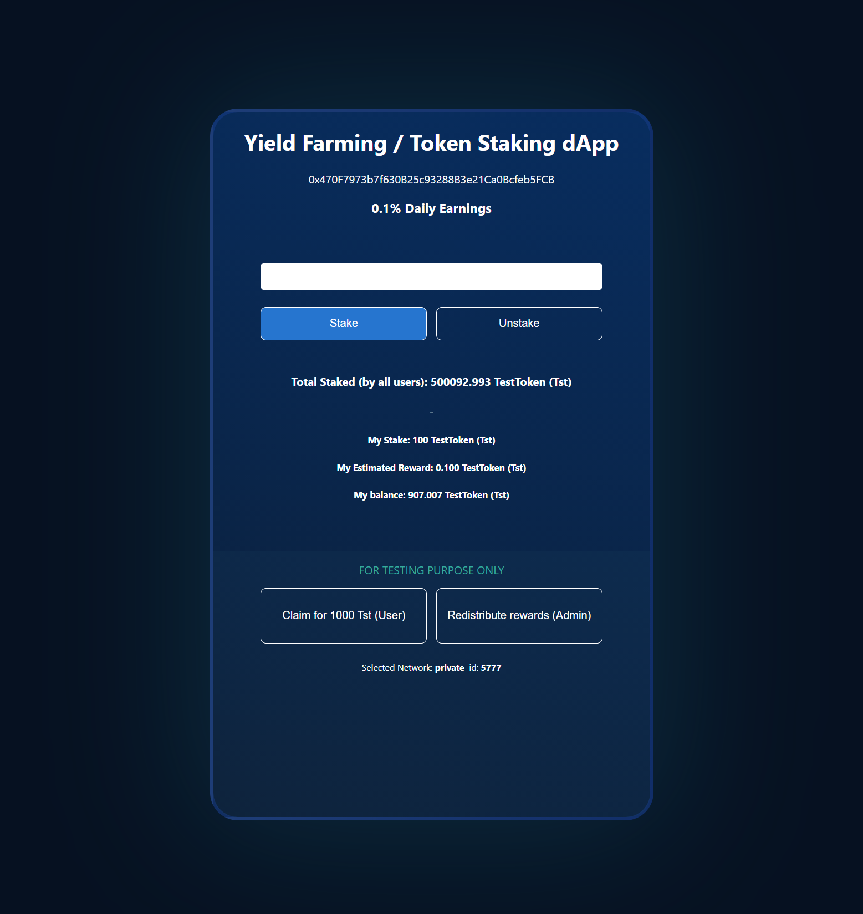
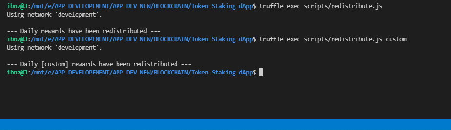
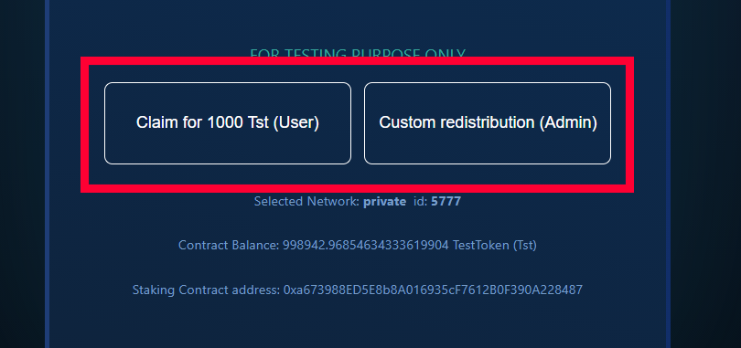

# Token Staking dApp <h1>

Working Demo: https://ibnz-staking.netlify.app/

#### Blockchain Token Staking dApp built with React, Solidity, on Ethereum Ganache, Ropsten, Rinkeby testnet networks <h6>



- 
 ## License and Legal Agreement 
IMPORTANT

This application and its code is NOT free to use, modify or resale. 
By using it you agree to not violate Plagiarism and Copyright Infringment

In order to use application code for modification or on own projects please contact info@ibnz.co.uk to obtain full licence. 

```
The idea of me including licensing and restrictions is mainly to protect users from reselling the software. The software was created for educational purposes and should be used mainly as a reference. 
However, there are a few very successful projects who are using my code without giving credit back. My application description is included on their whitepaper, where developers claim that this is the product they developed.  Some haven't even changed the UI :)

In order to stop scenarios like this, I included a little description where I mention the License for the software.  
The License is a written agreement from me that issues full rights to modify, resell, and use software and code without giving credit to the author or original repo. 

The License fee is 0.3 ETH
I charge everyone the same price and I found this to be a genuine and fair price to charge. 
 ```
-
 
## Changes
- [x] Added ERC20 TestToken 
- [x] Added Token Staking basic contract
- [x] Started testing 
* 
- [x] Updated Token Staking contract
- [x] Added ability to stake, unstake, redistribute
- [x] Implemented testing 
- [x] Added redistribution script
* 
- [x] Injected web3 and Metamask
- [x] Ability to detect if Metamask installed, logged, locked
- [x] Added skeletons for totalStaked, myStake, 
- [x] Added skeletons for Tester to Redistribute rewards and claim test tokens
* 
- [x] Added ability to load contracts
- [x] Fetching data from TokenStaking contract
- [x] Fetching balances
- [x] Stake, Unstake is now working
- [x] Redistribute rewards for (Admin only) is now working
* 
- [x] Implemented totalStaked
- [x] Implemented ability to claim test token(Tst) (FOR TESTING PURPOSE ONLY)
- [x] Added amount type validity check
- [x] Add ability for user to stake max 
* 
- [x] Added ability to listen to triggers .on transactionHash
- [x] Data automatically fetched after confirmation received
- [x] Added HDWallet provider and Infura setup
- [x] Deployed on ropsten and rinkeby
* 
- [x] Different staking pool implemented customStake/customUnstake
- [x] Implemented ability for admin to change custom pool APY value via script
* 
- [x] Implemented custom reward Pool redistribution
- [x] Contract Source Code Verified (Exact Match)
* 
- [x] Components split in to smaller
- [x] Added frontend logic for custom pools
- [x] Added UI Elements
- [x] Loaders fixed
* 
- [x] Added checks and restrictions for when Metamask is not connected
- [x] UI Optimised for mobiles
- [x] Production build uploaded to https://ibnz-staking.netlify.app/ for preview and test run


## Running instructions
* Copy project to your directory ( `git clone https://github.com/ibnzUK/Token-Staking-dApp` )
* Install project packages (`npm install`)
* Start project (`npm run start`)

## For Testing
* To run tests, navigate to /test/TokenStaking and run: `truffle test`
 
## For Admin Use
* There are prewritten scripts for Admin use either manually or on daily, weekly basic, ideally with predefined cronjob from the server.
* All scripts are located in `/scripts` folder
* To change APY % run: ```truffle exec scripts/changeAPY.js 0.137``` this script takes 1 argument (daily APY),  in this provided example, admin sets `0.137` daily APY 
 
* To redistribute rewards from the console, run: ```truffle exec scripts/redistribute.js``` or provide argument `custom` if you want to redistribute custom rewards
  


## Mocha testing output
 ``` Contract: TokenStaking
    TestToken deployment
      ✓ token deployed and has a name (246ms)
    TokenStaking deployment
      ✓ staking contract deployed and has a name (160ms)
      ✓ checking default APY value (179ms)
      ✓ checking custom APY value (128ms)
      ✓ staking contract has 500k TestTokens tokens inside (176ms)
    TokenStaking stakeTokens function
      ✓ users balance is correct before staking (126ms)
      ✓ checking total staked before any stakes (126ms)
      ✓ approving tokens, staking tokens, checking balance (1259ms)
      ✓ checking contract balance after staking (156ms)
      ✓ checking user balance inside contract (131ms)
      ✓ checking total staked (136ms)
      ✓ testing if user is staking at the moment (148ms)
      ✓ testing if user has staked (145ms)
    TokenStaking redistributeRewards function
      ✓ checking who can do redistribution (1059ms)
      ✓ checking TokenStaking balance (105ms)
      ✓ checking user balance (130ms)
    TokenStaking unstakeTokens function
      ✓ unstaking and checking users balance after unstake (468ms)
      ✓ checking total staked (132ms)
    TokenStaking [custom] staking/unstaking functions
      ✓ checking total custom staked before any stakes (132ms)
      ✓ checking users balance before staking (165ms)
      ✓ approving tokens, staking tokens, checking balance (1131ms)
      ✓ checking custom total staked (125ms)
      ✓ testing if user is staking at custom staking at the moment (147ms)
      ✓ testing if user has staked at custom staking (107ms)
      ✓ unstaking from custom staking and checking users balance  (535ms)
    Claim Tst
      ✓ trying to obtain 1000 test token (395ms)
    Change custom APY value
      ✓ checking who can change APY (1115ms)
      ✓ checking new custom APY value (146ms)
    Testing custom APY reward redistribution
      ✓ staking at customStaking (1299ms)
      ✓ redistributing rewards, checking who can redistribute (733ms)
      ✓ checking user balance after custom APY rewards  (111ms)
```      

## Deployoment to Ethereum network and Verification

For private Ethereum test network make sure Ganache is running on HTTP://127.0.0.1:7545
* First configure `truffle-config.js` with your infura key and mnemonic key. You can reate files in top dirrectory under names `.infuraKey` and `.secret` and paste your keys in there
* If you planning to publish your project on github make sure you `.gitignore` your keys 
* Compile smart contracts with `truffle compile`
* Deploy to your local (Ganache) network run: `truffle migrate --reset ` or for Ethereum test network (Rinkeby) run: `truffle migrate --network rinkeby --reset` or change `rinkeby` to `ropsten`
* To verify contract code on Ethereum test network add your Etherscan API key to `.ethKey` and for (Rinkeby) run: `truffle run verify TestToken --network rinkeby` or change `rinkeby` to `ropsten`
#
TokenStaking Smart Contract Address on Test Net
* Ropsten: Verified: https://ropsten.etherscan.io/address/0x0Fab2A018bB44DD2a6Ef7C55F057Dd9d9eC1B19F#contracts
* Rinkeby: Verified: https://rinkeby.etherscan.io/address/0xAf9352B33E9B08A86dD04fcD8533DbC75BD2c8d1#contracts
#
TestToken Contract Address on Test Net
* Ropsten: Verified: https://ropsten.etherscan.io/address/0x0190f80487179053eb85451454541644AbAf4048#contracts
* Rinkeby: Verified: https://rinkeby.etherscan.io/address/0xb54039DAC3C4ADdAC082e86a6e9C290E80af9488#contracts
#
Current Admin on Test Net
* Ropsten, Rinkeby : 0x3349ca399168dF1c0df96a49410F5F9940241AbC


# Warning, known security issue, use at own risk <h1> 

Front end functions to `Claim for 1000 Tst` token and `Redistribute rewards or Custom redistribution` are only for testing purpose and showcase of application. Do not include or use them in your final project.



 


